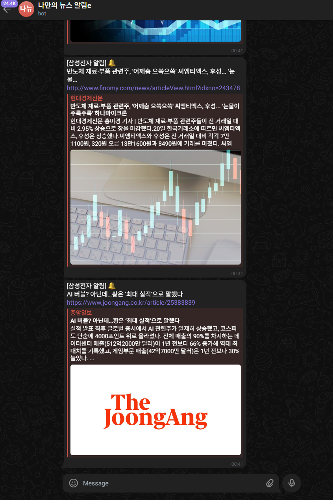

# keyword-hunter-b# 🕵️‍♀️ Keyword Hunter Bot (Real-time News Monitor)



원하는 키워드의 최신 뉴스를 실시간으로 감지하여 텔레그램 봇으로 즉시 리포트하고, 전송 이력을 Supabase(PostgreSQL)에 적재하여 데이터 중복을 스마트하게 필터링하는 자동화 솔루션입니다.

## ✨ Key Features
- **실시간 모니터링:** Python `requests`, `bs4`를 활용한 가벼운 크롤링 엔진
- **스마트 중복 방지:** **Supabase(PostgreSQL)**를 연동하여 이미 전송된 뉴스는 필터링
- **즉시 알림:** 텔레그램 API를 통한 실시간 메시지 푸시
- **안정성:** 스케줄러 탑재 및 에러 로깅 시스템 구축

## 🛠 Tech Stack
- **Language:** Python 3.10+
- **Database:** Supabase (Serverless PostgreSQL)
- **Library:** BeautifulSoup4, Requests, Schedule, Supabase-py

## 🚀 How to Run
1. **환경 변수 설정 (.env)**
   ```bash
   SUPABASE_URL=your_url
   SUPABASE_KEY=your_key
   TELEGRAM_BOT_TOKEN=your_tokenot

## 📊 Database Schema (Supabase)
- 이 프로젝트는 Supabase의 news_logs 테이블을 사용합니다.

- id (int8, primary key)

- title (text)

- link (text, unique)

- created_at (timestamptz, default: now())